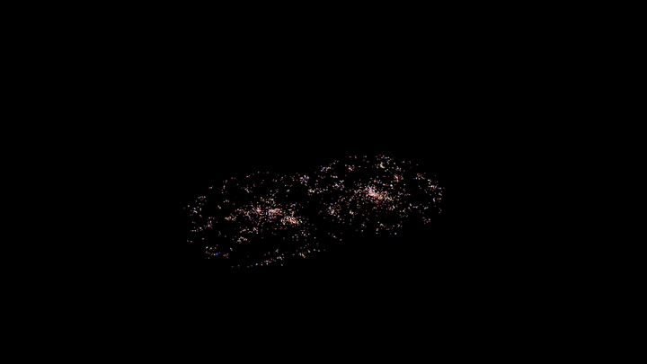
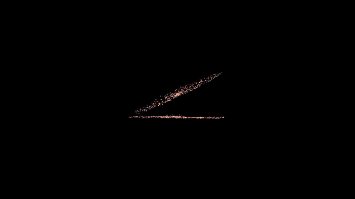

# galaxy_collision
This is a simple galaxy collision simulator implemented in OpenGL. It cannot simulate stable spiral galaxies, as dark matter is ignored. On my hardware, it generally caps out at around 2200-2500 stars before no longer running in real time. Most constants are arbitrarily chosen to produce good results quickly, not extremely realistic results.

### Output
This supports an arbitrary number of galaxies to be simulated, and does show some expected behaviour, like the formation of elliptical galaxies, star ejection, and creation of satellite dwarf galaxies.

### How to Use
Once the program is compiled, simply run the executable from the root directory. WASD controls the camera, and +/- will zoom in and out. It is not possible to move pan the camera, only rotate about the origin. To change the initial environment, modifications of the main method must be made, and the program recompiled. In particular, you just want to add more galaxies to the universe object around line 287.

Note that this will not work on Windows.

### Compilation
On a unix system with an up to date OpenGL installation, just run `make`. The executable is called `main` and can be run without any arguments.
